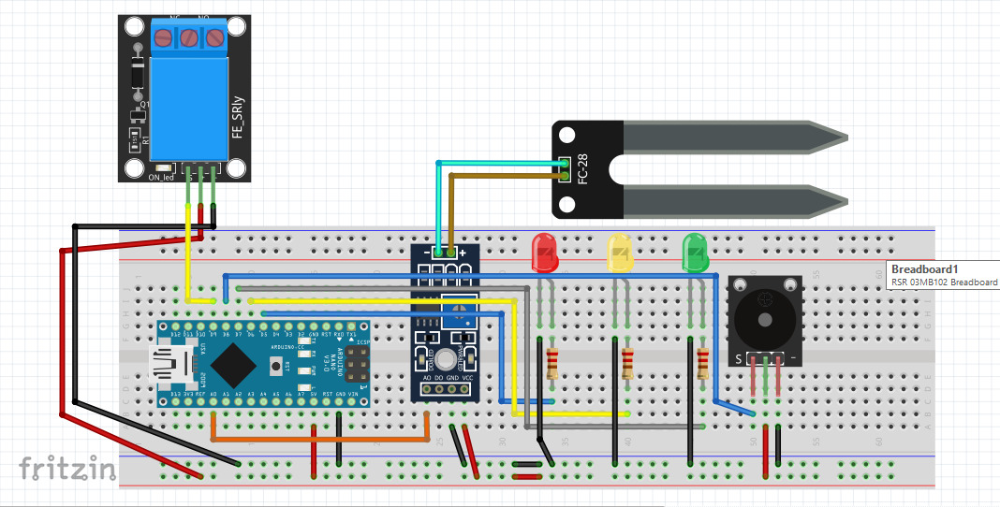

# sistema_irrigacao
Sistema de Umidade do Solo evoluído para um Sistema de Irrigação Automatizado. 
Não deixe de conferir a aula de disponível em:
https://www.youtube.com/watch?v=7vLDt_IYypo&t=27s 

Segue o esquema físico: 

